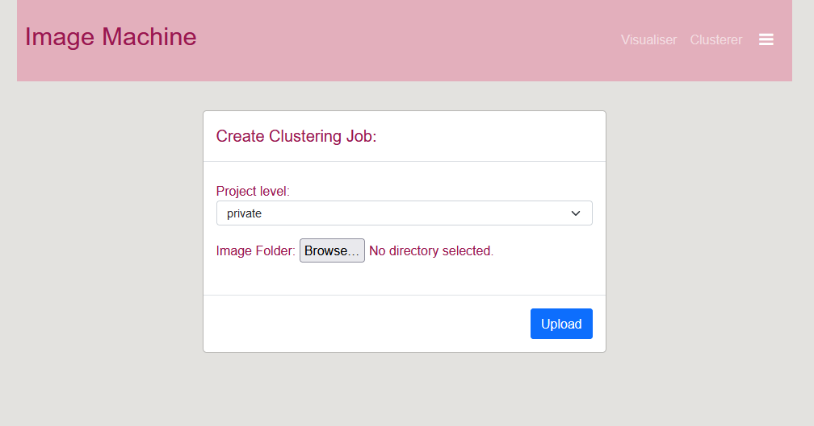
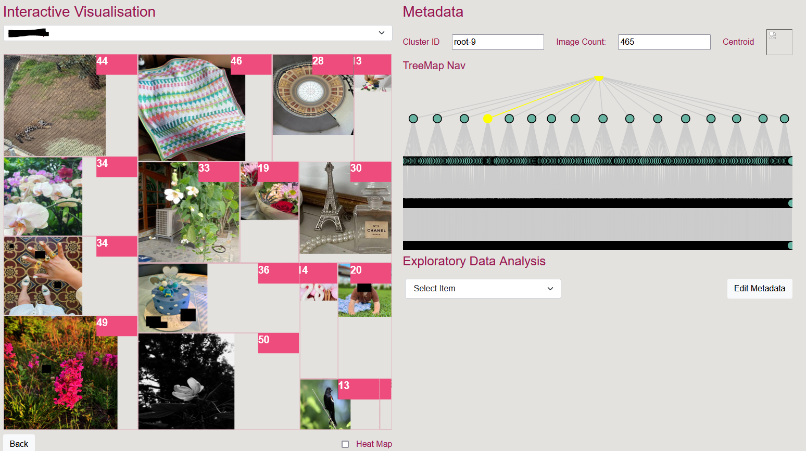

# Image Machine

A tool to perform unsupervised clustering on a set of images by employing different algorithms such as VGG16 and VGG19.

## Interface

This [tool](http://3.26.11.157/) is strictly used for **RESEARCH** purpose only, kindly contact [x28.tan@qut.edu.au](mailto:x28.tan@qut.edu.au) for access. 

There are two parts to this tool. 

### Clusterer
You can select the *project level* with which this image set is associated. It's *private* by default. Image sets that are uploaded and clustered under *private* level can only be viewed by the user. If a user uploads an image set under a project level other than private, other members that have clearance to that project level will also be able to see the image set in visualiser when it's ready. Users can upload multiple datasets without having to wait for the first one to finish uploading. Once an image set is uploaded, it will be added to the queue, the Machine Learning component will then process and cluster the image set. The processing time varies from 30 minutes to a few hours depending on the size. The result can be viewed in the visualiser when it's ready.   


### Visualiser
There are multiple components in the visualiser. First step is to select the dataset you like to inspect. 


**Image Clusters**
The approach we use is a combination of K-means and Hierarchical clustering methods. Starting from the top/root level, the images will be separated into 16 groups on the machine's interpretation of their similarities, some groups will be larger than the other. On each level, one box represents a cluster/group at that level. In the top right corners of each box, the number represents image count in each cluster. Image count on the right next to cluster ID represent the total number of images in the cluster you're currently in. For instance, you're at root level, the image count will be indicative of the total number of images in the entire image set. The 16 clusters you see on the left will be the 16 subclusters within root level(aka the entire dataset). As you click on one image, you will go one level down to that specific cluster. Cluster ID will update to show you the current cluster you're inpecting(e.g. root-14) and image count will update to the number of images in root-14. The visualisation will also be updated to all the subclusters within root-14.    

**Cluster ID**
You can modify this box and press <return> or <enter> to take you to the specific cluster directly without having to navigate through the images on the left.

**TreeMap Nav**
This tree graph provides navigability on whereabout the cluster you're inpsecting is at within the entire multi-level, multi-clusters Hierarchical K-means structure. 

**Exploratory Data Analysis**
Edit metadata button allows you to upload metadata associated with this image set. A column that contains image names needs be included to serve as a key to link metadata to the images on the left. Once metadata is uploaded, you can drag and drop columns names to different boxes for analysis. The critical part is to drag the image column to the top (to link images to their corresponding metadata), and then you can drag and drop any other attributes(columns) to **‘Category’** or **‘Hashtag’** box depending on whether you like to identify categories or detect hashtags for that specific column. After clicking ‘Apply Changes’, you can select an attribute from the dropdown, different groupings will be displayed alongside the number of images which belong to that grouping. Each grouping can be clicked and the numbers will be updated on the left to show you where the images belong to the selected grouping are dispersed in the clusters on the left in terms of image count.   

## Back-End
### From your environment

```
cd anaconda
conda create --name "your_env" python=3.7 tensorflow-gpu=2.3.0 cudnn=7.6.5
activate <your_env>
git clone https://github.com/qut-dmrc/ImageMachine.git
cd ImageMachine
pip install -r requirements.txt
cd ml
pip install -e .
create static folder within graph
create input_data\ folder within ml folder with two subfolders images\ and metadata\
|ml
  |imagemachine
    ...
  |input_data
    |images
      |your_img_folder
        1.jpg
        2.jpg
         ...
    |metadata
       metadata.json/metadata.csv/[None]
|graph
  |static
```

## Usage

### Command Line

```

Usage: im [OPTIONS]

Options:
  -config, --config TEXT
  -img, --img TEXT
  -zip, ---zip TEXT
  -metadata, --metadata TEXT
  -fieldname, --fieldname TEXT
  -d, --download
  -s, --size INTEGER
  -t, --time
  -size_list TEXT
  -log
  --help
```

### Visualization

```
Rename the clusters_<number>.json in graph/dist/static to clusters.json
Move the folder of images to dist if any
npm install
npm run build
npm run dev
```

